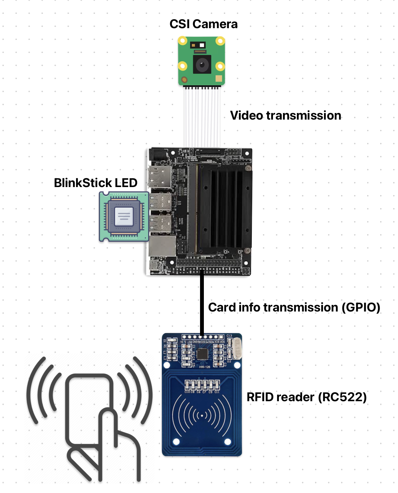
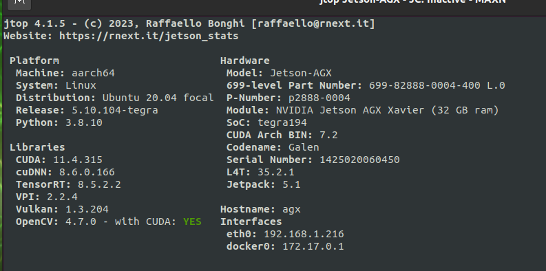
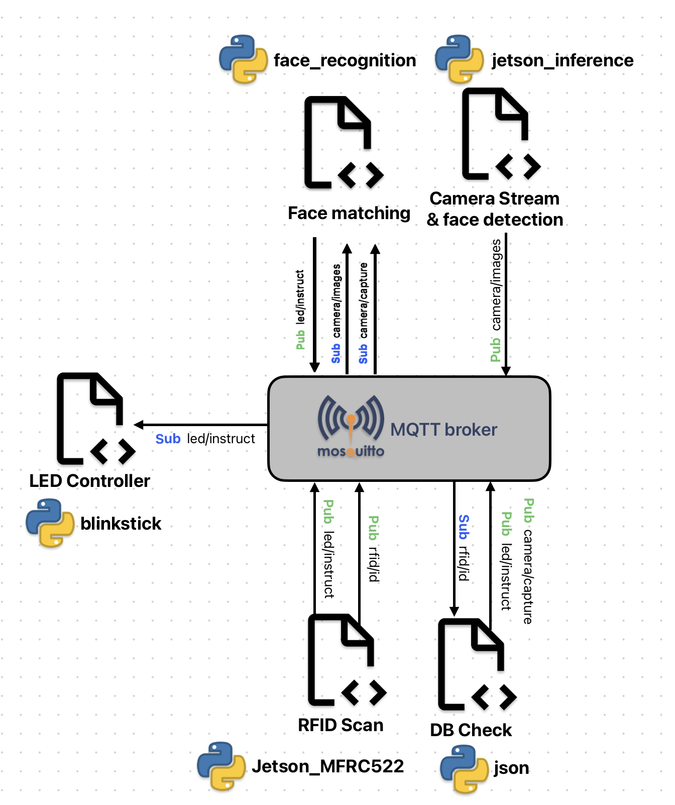

# Face authentication security gate (prototype)

Ce projet propose une architecture logicielle de détection faciale, de reconnaissance faciale et de scan RFID.

Cette architecture logicielle à été concu pour etre supporté par la plateforme matérielle [Nvidia Jetson](https://developer.nvidia.com/embedded/jetson-modules).

## Hardware architecture

| Item                     | Role                     | Reference                                                                                                                                                                                                                                                                                                                                                                                                          |
| ------------------------ | ------------------------ | ------------------------------------------------------------------------------------------------------------------------------------------------------------------------------------------------------------------------------------------------------------------------------------------------------------------------------------------------------------------------------------------------------------------ |
| Nvidia Jetson Nano (B01) | Computatioon, storage    | [Link to documentation](https://developer.download.nvidia.com/assets/embedded/secure/jetson/Nano/docs/NV_Jetson_Nano_Developer_Kit_User_Guide.pdf?4quE5F-tWlCtSEdMkxS5bVBsldDSwNmyJMeZPAKPey8pzQSh5iRBtGjz82gCnqvPjg4GmeY3NnfKIPaDs9X01izyRyShqFKF6masu9v0WulAghbUE_VcFj9vrAYWMwEsJSpIX6t4ypZ-slsN0VNawh54eT5NBID83n2Xrt_LxXLM0h70Sl07Q2dnu6XgfYUj3qA=&t=eyJscyI6InJlZiIsImxzZCI6IlJFRi1kdWNrZHVja2dvLmNvbS8ifQ==) |
| CSI Camera (IMX219)      | video acquisition        | [Link to product](https://www.raspberrypi.com/products/camera-module-v2/)                                                                                                                                                                                                                                                                                                                                          |
| RFID scanner (RC522)     | Card ID acquisition      | [Link to product](https://www.az-delivery.de/fr/products/rfid-set)                                                                                                                                                                                                                                                                                                                                                 |
| Blinkstick LED           | System behavior feedback | [Link to product](https://www.blinkstick.com/products/blinkstick-nano)                                                                                                                                                                                                                                                                                                                                             |

Comme c'est un prototype et qu'il a donc pour visée de démontrer la possibilité du concept, le portail de sécurité est remplacé par une LED qui décrit le comportement du système.
Par exemple, la LED va clignoter en vert pour décrire la validation de l'authentification et donc l'ouverture du portail. A l'inverse, la LED va clinoter en rouge pour indiquer une non autorisation de passage ou un défaut empechant l'ouverture.

## Software architecture

Le matériel de la Nvidia Jetson Nano B01 (developper kit) n'est compatible qu'avec Jetpack v4.
Plus d'information sur les composantes logiciel principales via l'écran ci dessus (jetson-stats / jtop).

